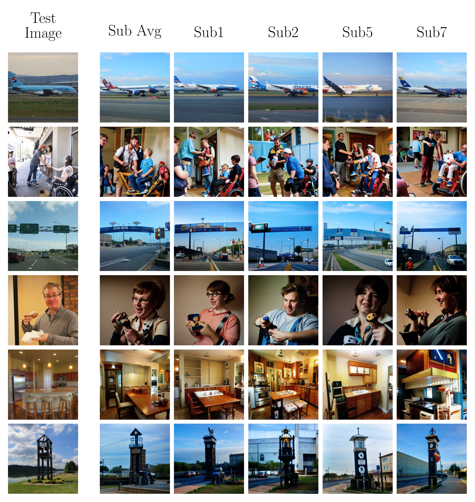

# Brain-Diffuser
Official repository for the paper ["**Brain-Diffuser: Natural scene reconstruction from fMRI signals using generative latent diffusion**"](https://arxiv.org/abs/2303.05334) by Furkan Ozcelik and Rufin VanRullen.

## Results
The following are a few reconstructions obtained : 
<p align="center"></p>

## Instructions 

### Requirements
* Create conda environment using environment.yml in the main directory by entering `conda env create -f environment.yml` . It is an extensive environment and may include redundant libraries. You may also create environment by checking requirements yourself. 

### Data Acquisition and Processing

1. Download NSD data from NSD AWS Server:
    ```
	cd data
	python download_nsddata.py
	```
2. Download "COCO_73k_annots_curated.npy" file from ["HuggingFace NSD"](https://huggingface.co/datasets/pscotti/naturalscenesdataset/tree/main)
3. Prepare NSD data for the Reconstruction Task:
    ```
	cd data
	python prepare_nsddata.py -sub 1
    python prepare_nsddata.py -sub 2
    python prepare_nsddata.py -sub 5
    python prepare_nsddata.py -sub 7
	```

### First Stage Reconstruction with VDVAE

1. Download pretrained VDVAE model files and put them in `vdvae/model/` folder
```
wget https://openaipublic.blob.core.windows.net/very-deep-vaes-assets/vdvae-assets-2/imagenet64-iter-1600000-log.jsonl
wget https://openaipublic.blob.core.windows.net/very-deep-vaes-assets/vdvae-assets-2/imagenet64-iter-1600000-model.th
wget https://openaipublic.blob.core.windows.net/very-deep-vaes-assets/vdvae-assets-2/imagenet64-iter-1600000-model-ema.th
wget https://openaipublic.blob.core.windows.net/very-deep-vaes-assets/vdvae-assets-2/imagenet64-iter-1600000-opt.th
```
2. Extract VDVAE latent features of stimuli images for any subject 'x' using `python scripts/vdvae_extract_features.py -sub x`
3. Train regression models from fMRI to VDVAE latent features and save test predictions using `python scripts/vdvae_regression.py -sub x`
4. Reconstruct images from predicted test features using `python scripts/vdvae_reconstruct_images.py -sub x`

### Second Stage Reconstruction with Versatile Diffusion

1. Download pretrained Versatile Diffusion model "vd-four-flow-v1-0-fp16.pth" from ["HuggingFace"](https://huggingface.co/shi-labs/versatile-diffusion/tree/main/pretrained_pth)
2. Extract CLIP-Text features of captions for any subject 'x' using `python scripts/cliptext_extract_features.py -sub x`
3. Extract CLIP-Vision features of stimuli images for any subject 'x' using `python scripts/clipvision_extract_features.py -sub x`
4. Train regression models from fMRI to CLIP-Text features and save test predictions using `python scripts/cliptext_regression.py -sub x`
5. Train regression models from fMRI to CLIP-Vision features and save test predictions using `python scripts/clipvision_regression.py -sub x`
6. Reconstruct images from predicted test features using `python scripts/versatilediffusion_reconstruct_images.py -sub x` . This code is written as you are using two 12GB GPUs but you may edit according to your setup. 

## References
- Codes in vdvae directory are derived from [openai/vdvae](https://github.com/openai/vdvae)
- Codes in versatile_diffusion directory are derived from earlier version of[SHI-Labs/Versatile-Diffusion](https://github.com/SHI-Labs/Versatile-Diffusion)
- Dataset used in the studies are obtained from [Natural Scenes Dataset](https://naturalscenesdataset.org/)